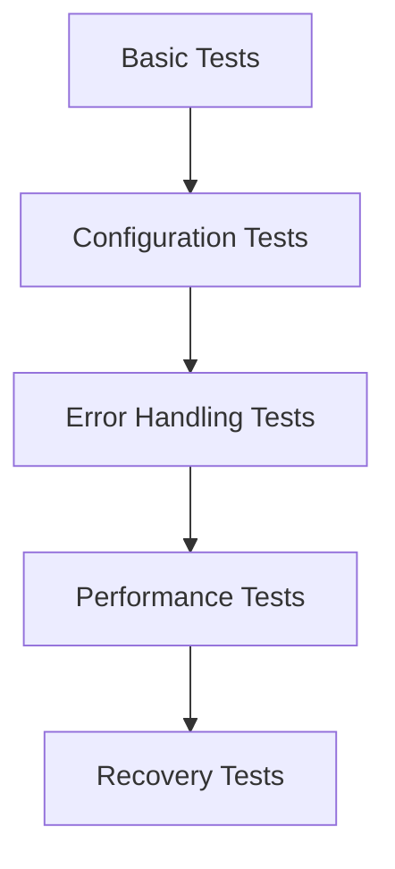

# fluss-flink: Go to guide to inetract with fluss via flink engine


## Why Fluss?
[Fluss](https://apache.github.io/fluss-docs/docs/intro/) is a streaming storage built for real-time analytics which can serve as the real-time data layer for Lakehouse architectures.
It bridges the gap between streaming data and the data Lakehouse by enabling low-latency, high-throughput data ingestion and processing while seamlessly integrating with popular compute engines.

## Why Fluss-Flink Quickstart
It's an unofficial experimental sample Apache Flink DataStream/SQL application that demonstrates real-time data processing using [Apache Fluss](https://github.com/Apache/fluss) as both source and sink. Enabling developers to explore Fluss within Flink ecosystems.
# 


## Overview

This project shows how to:
- Read data from a Fluss table using DataStream/SQL API
- Process data in real-time with transformations
- Write processed results back to another Fluss table
- Handle both primary key tables and log tables in Fluss

## Prerequisites

- Java 11 or higher
- Maven 3.6+
- Apache Flink 1.18+ (for DataStream/SQL API compatibility)
- Git

## Setup Instructions

### Step 1: Start Local Fluss Cluster

#### 1.1 Build and Install Fluss Locally

```bash
# Clone and build Fluss
git clone https://github.com/alibaba/fluss.git
cd fluss
mvn clean install -DskipTests

# Extract the built distribution
cd fluss-dist/target
tar -xzf fluss-*-bin.tgz

# Set FLUSS_HOME environment variable
export FLUSS_HOME=$(pwd)/fluss-0.7-SNAPSHOT

# Verify installation
echo $FLUSS_HOME
ls -la $FLUSS_HOME/bin/
```

#### 1.2 Start Fluss Cluster

```bash
# Start local cluster (recommended for testing)
$FLUSS_HOME/bin/local-cluster.sh start

# Alternative: Start services individually
# $FLUSS_HOME/bin/coordinator-server.sh start
# sleep 5
# $FLUSS_HOME/bin/tablet-server.sh start

# Verify services are running
jps | grep -E "(CoordinatorServer|TabletServer)"
```

### Step 2: Setup Flink with Fluss Connector

#### 2.1 Verify Flink Version

```bash
# Install flink locally via SDK-MAN

curl -s "https://get.sdkman.io" | bash
sdk install flink

# Check Flink version (must be 1.18+)

$FLINK_HOME/bin/flink --version

# If using older version, download Flink 1.18.1:
# wget https://downloads.apache.org/flink/flink-1.18.1/flink-1.18.1-bin-scala_2.12.tgz
# tar -xzf flink-1.18.1-bin-scala_2.12.tgz
# export FLINK_HOME=$(pwd)/flink-1.18.1
```

#### 2.2 Install Fluss Connector

```bash
# Stop Flink if running
$FLINK_HOME/bin/stop-cluster.sh

# Copy Fluss connector JAR to Flink lib directory
cp $FLUSS_HOME/../fluss-flink/fluss-flink-1.18/target/fluss-flink-1.18-0.7-SNAPSHOT.jar $FLINK_HOME/lib/

# Verify JAR installation
ls -la $FLINK_HOME/lib/ | grep fluss

# Start Flink cluster
$FLINK_HOME/bin/start-cluster.sh
```

### Step 3: Create Test Tables

#### 3.1 Start Flink SQL CLI

```bash
$FLINK_HOME/bin/sql-client.sh
```

#### 3.2 Create Tables and Test Data via SQL

```sql
-- Create Fluss catalog
CREATE CATALOG fluss_catalog WITH (
  'type' = 'fluss',
  'bootstrap.servers' = 'localhost:9123'
);

-- Switch to Fluss catalog
USE CATALOG fluss_catalog;

-- Verify catalog
SHOW CURRENT CATALOG;

-- Create source table (Log Table)
CREATE TABLE Fluss_A (
  id BIGINT,
  name STRING,
  age INT,
  score DOUBLE,
) WITH (
  'bucket.num' = '4'
);

-- Create sink table (Log Table)
CREATE TABLE Fluss_B (
  id BIGINT,
  name STRING,
  age INT,
  score DOUBLE,
  processed_time BIGINT
) WITH (
  'bucket.num' = '4'
);

-- Insert test data
INSERT INTO Fluss_A VALUES
  (1, 'Jark', 45, 95.5),
  (2, 'Giannis', 52, 87.2),
  (3, 'Mehul', 60, 92.8);

-- Switch to tableau mode for better formatting and column headers
SET 'sql-client.execution.result-mode' = 'tableau';
    
-- Verify data
SELECT * FROM Fluss_A;

-- Check the table schema
DESCRIBE Fluss_A;

## For Upsert/PK Mode

-- Create source PrimaryKey table Fluss_PK_A 
CREATE TABLE Fluss_PK_A (
                           id BIGINT,
                           name STRING,
                           age INT,
                           score DOUBLE,
                           PRIMARY KEY (id) NOT ENFORCED
) WITH (
     'bucket.num' = '4'
     );

-- Create sink PrimaryKey table Fluss_PK_B
CREATE TABLE Fluss_PK_B (
                           id BIGINT,
                           name STRING,
                           age INT,
                           score DOUBLE,
                           processed_time BIGINT,
                           PRIMARY KEY (id) NOT ENFORCED
) WITH (
     'bucket.num' = '4'
     );

-- For Multi table union stream sink
CREATE TABLE Fluss_PK_Target (
                                id BIGINT,
                                name STRING,
                                age INT,
                                score DOUBLE,
                                processed_time BIGINT,
                                PRIMARY KEY (id) NOT ENFORCED
) WITH (
     'bucket.num' = '4'
     );

-- Insert test data with updates to test UPSERT behavior
INSERT INTO Fluss_PK_A VALUES
                          (1, 'Jark', 45, 95.5),
                          (2, 'Giannis', 52, 87.2),
                          (3, 'Mehul', 60, 92.8);


-- Update works in batch mode
SET 'execution.runtime-mode' = 'batch';


-- Update some records to generate changelogs
UPDATE Fluss_PK_A SET score = 99.0 WHERE id = 1;
UPDATE Fluss_PK_A SET age = 53 WHERE id = 2;

-- To revert
SET 'execution.runtime-mode' = 'streaming';


```

### Step 4: Build and Run the DataStream Application

#### 4.1 Clone This Repository

```bash
git clone <your-repo-url>
cd Flink-Fluss-Quickstart-Examples
```

#### 4.2 Build the Project

```bash
mvn clean compile
```

#### 4.3 Run the Application

```bash
# Run from IDE (IntelliJ IDEA)
# Or run via Maven
mvn exec:java -Dexec.mainClass="com.example.FlussDataStreamApp"
```

# Fluss DataStream API - Job Types & Package Organization

## 📁 Package Structure Overview

```
src/main/java/com/
├── 📦 common/                    # Shared components
├── 📦 scanModes/                 # Offset initialization strategies  
├── 📦 projection/                # Column pruning tests
├── 📦 exampleAppend/             # Log table operations
├── 📦 exampleUpsert/             # Primary key table operations
├── 📦 exampleDelete/             # Deletion scenarios
├── 📦 exampleRowData/            # Built-in schemas
├── 📦 differentClientConfigs/    # Client configuration tests
├── 📦 multiTable/                # Multi-source/sink processing
├── 📦 recoveryModes/             # Fault tolerance & recovery
└── 📦 errorHandling/             # Error handling & validation
```

## 🎯 Job Types by Category

### 1. 📖 Data Reading Strategies (`scanModes`)

| Job Class | Purpose | Fluss API | Use Case |
|-----------|---------|-----------|----------|
| `FlussFullModeTest` | Read snapshot + changelogs | `OffsetsInitializer.full()` | Initial load + real-time |
| `FlussLatestModeTest` | Read new changes only | `OffsetsInitializer.latest()` | Real-time processing |
| `FlussEarliestModeTest` | Read all historical changes | `OffsetsInitializer.earliest()` | Data replay/recovery |

**Example Output Differences:**
- **Full Mode**: Shows all existing data first, then new changes
- **Latest Mode**: Shows only changes after job starts
- **Earliest Mode**: Shows historical changelog events in order
- **Timestamp Mode**: Shows changes from specified timestamp

### 2. 🎯 Data Processing Optimizations (`projection`)

| Job Class | Purpose | Fluss API | Benefit |
|-----------|---------|-----------|---------|
| `FlussProjectedFieldsTest` | Column pruning | `setProjectedFields()` | Reduced I/O, memory usage |

**Key Feature**: Only reads specified columns, others appear as `null`

### 3. 📝 Write Operations by Table Type

#### Log Tables (`exampleAppend`)
| Job Class | Operation | Table Type | Use Case |
|-----------|-----------|------------|----------|
| `FlussDataStreamApp` | APPEND | Log Table | Event logging, metrics |

#### Primary Key Tables (`exampleUpsert`)
| Job Class | Operation | Table Type | Use Case |
|-----------|-----------|------------|----------|
| `FlussDataStreamPKApp` | UPSERT | PK Table | Business entities, dimensions |

#### Delete Operations (`exampleDelete`)
| Job Class | Operation | Scenario | Real-World Example |
|-----------|-----------|----------|-------------------|
| `FlussDeleteTest` | DELETE | General deletion | Data cleanup |

### 4. ⚙️ Configuration & Performance (`differentClientConfigs`)

| Job Class | Configuration Area | Options Tested |
|-----------|-------------------|----------------|
| `FlussCustomOptionsTest` | Writer optimization | `batch-size`, `batch-timeout`, `buffer.memory-size` |
| `FlussShuffleControlTest` | Data distribution | `setShuffleByBucketId()` |

### 5. 🏗️ Advanced Patterns

#### Built-in Schemas (`exampleRowData`)
| Job Class | Schema Type | Benefit |
|-----------|-------------|---------|
| `FlussBuiltinSchemasTest` | RowData native schemas | Better performance |

#### Multi-Table Processing (`multiTable`)
| Job Class | Pattern | Use Case |
|-----------|---------|----------|
| `FlussMultiTableTest` | Union → Route → Multiple sinks | Complex data pipelines |

#### Fault Tolerance (`recoveryModes`)
| Job Class | Focus Area | Testing Aspect |
|-----------|------------|----------------|
| `FlussCheckpointRecoveryTest` | State management | Exactly-once processing |


## 🚀 Execution Workflow

### 1. Basic Testing Flow


### 2. Advanced Testing Flow


## 📊 Test Matrix

| Feature | Log Table | PK Table | Status |
|---------|-----------|----------|--------|
| Append Operations | ✅ | ❌ | Complete |
| Upsert Operations | ❌ | ✅ | Complete |
| Delete Operations | ❌ | ✅ | Complete |
| Full Mode Reading | ✅ | ✅ | Complete |
| Latest Mode Reading | ✅ | ✅ | Complete |
| Projection | ✅ | ✅ | Complete |
| Custom Configs | ✅ | ✅ | Complete |
| Error Handling | ✅ | ✅ | Complete |


## 🔧 Customization Guide

### Adding New Job Types

1. **Create package** for new functionality area
2. **Follow naming convention**: `Fluss[Feature]Test`
3. **Include comprehensive logging** for verification
4. **Add error handling** for production readiness
5. **Update documentation** with new examples

### Package Naming Convention

```
com.[functionality]/
├── Fluss[Feature]Test.java           # Main test class
├── [Feature]SerializationSchema.java # Custom serializer if needed
├── [Feature]DeserializationSchema.java # Custom deserializer if needed
└── [Feature]Helper.java              # Utility classes if needed
```

This organization provides clear separation of concerns and makes it easy to find and run specific types of tests for different Fluss DataStream API features.

## Monitoring and Management

### Flink Web UI
Access the Flink Web UI at http://localhost:8081 to:

* Monitor running jobs and their status
* View job execution graphs and metrics
* Check checkpoint status and performance
* Review task manager resources
* Access job logs and exception details

## Job Management Commands

``` bash

# Submit a job

 $FLINK_HOME/bin/flink run \        
    -c (classPath) \
    (jarPath)

# Example for submitting a job
 $FLINK_HOME/bin/flink run \        
    -c com.example.FlussDataStreamApp \
    target/Flink-Fluss-Quickstart-1.0-SNAPSHOT.jar


# List running jobs
$FLINK_HOME/bin/flink list

# Cancel a job (replace <job-id> with actual job ID)
$FLINK_HOME/bin/flink cancel <job-id>

# Stop a job with savepoint
$FLINK_HOME/bin/flink stop <job-id>

# Get job status
$FLINK_HOME/bin/flink info <job-id>

```

## Key Features

### Data Processing Pipeline

1. **Source**: Reads from `Fluss_A` table using `FlussSource` DatastreamApi/Sql
2. **Processing**:
    - Adds processing timestamp
    - Increases score by 5 for people over 25
    - Logs processing details
3. **Sink**: Writes processed data to `Fluss_B` table using `FlussSink` DatastreamApi/Sql

### Configuration Highlights

- **Checkpointing**: Enabled with 5-second intervals for exactly-once semantics
- **Parallelism**: Set to 1 for simplicity
- **Offset Strategy**: Reads from earliest available data
- **Watermark Strategy**: No watermarks (for simplicity)


### Common Issues

1. **NoClassDefFoundError**: Ensure all Flink dependencies are included
2. **Connection refused**: Verify Fluss cluster is running on localhost:9123
3. **No data processing**: Check if test data exists in `Fluss_A` table

### Debug Steps

1. Check Fluss cluster status:
   ```bash
   jps | grep -E "(CoordinatorServer|TabletServer)"
   ```

2. Verify table data:
   ```sql
   SELECT * FROM fluss_catalog.default.Fluss_A;
   ```

3. Check application logs for detailed error messages

## Contributing

1. Fork the repository
2. Create a feature branch
3. Make your changes
4. Add tests if applicable
5. Submit a pull request

## License

[Add your license here]

## Resources

- [Alibaba Fluss Documentation](https://alibaba.github.io/fluss-docs/)
- [Apache Flink Documentation](https://flink.apache.org/docs/)

## Support

For issues and questions:
- Create an issue in this repository
- Check the Fluss project documentation
- Consult Flink community resources
